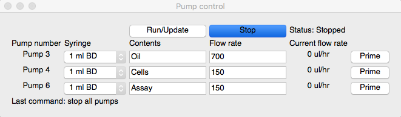

# syringe-pump-controller
Python GUI to operate New Era syringe pumps (such as [NE-500/501](https://www.syringepump.com/oem.php)).  Used to control flow rates in microfluidic devices. 

Currently runs in python2.  Requires PyQt4 and serial modules.

